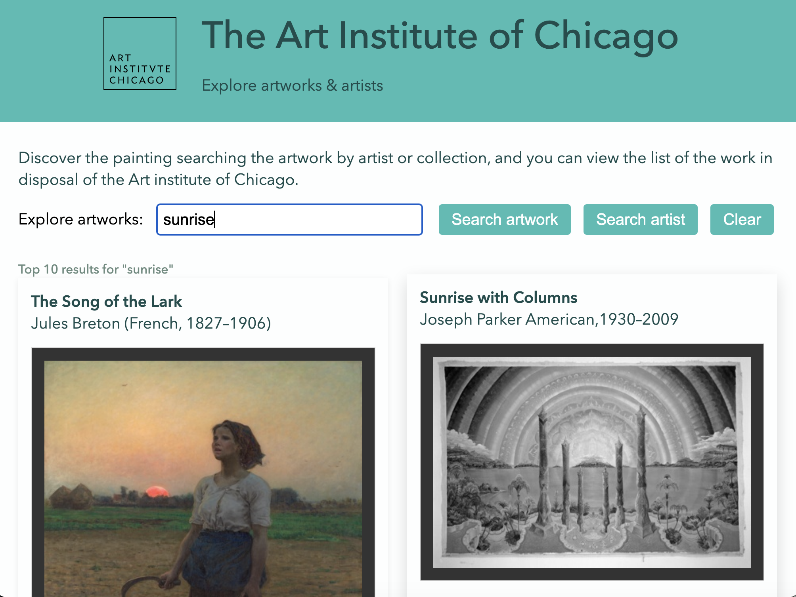
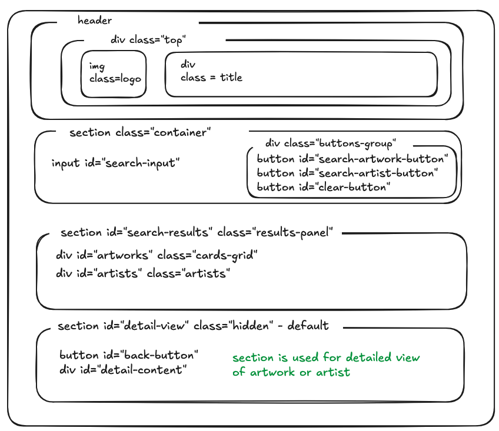

# The Art Institute of Chicago — Artwork Explorer

A small web app for browsing and searching artworks from the [Art Institute of Chicago's public API](https://api.artic.edu/docs/#introduction). Search by artwork title, artist name, browse results, and click to see more details on artwork or artist.

Built as pre-work for Code the Dream. Called next API:

- artwork API https://api.artic.edu/api/v1/artworks to search artworks and call details for specific artwork by id
- arstist API https://api.artic.edu/api/v1/agents to search artists and call details for specific artist by id
- image API called from iiif_url and image_id

```
    "config": {
        "iiif_url": "https://www.artic.edu/iiif/2",
    }
```

**Live demo:** https://olgagav.github.io/art-institute-of-chicago

***Note: Artwork images are loaded from the Art Institute of Chicago's IIIF image server and fail to load due to a Cross-Origin-Resource-Policy: same-origin restriction that blocks direct image requests from third-party origins; when this happens, the app shows thumbnail from responce.***

## Features

- Search artworks by keyword or title
- Search artists by name
- Browse a results in a card (for artwork)/list (for artist) layout 
- Click into any artwork or artist to view more detail, fetched live from the API 
- Navigate back to results without additional fetch request
- Added handling for empty results, and failed requests

## Usage

1. Enter a search term and click **Search artwork** or **Search artist**. Default search is artwork if click **Enter**
2. Browse search results
3. Click any artwork card or artist name to view more details
4. Click on **Back to results** to return to your search results
5. Click **Clear** to reset the search



## DOM Structure Diagram


## Tech stack
- HTML5
- CSS
- Vanilla JavaScript (ES modules, fetch API)
- Art Institute of Chicago API — no API key required

## Project structure

```
├── index.html      # Page markup
├── style.css       # Styling
├── script.js       # API calls, search logic, DOM rendering
├── logo.svg        # Site logo
├── default.png     # Fallback image for artworks/artists with no image
├── diagram.png     # DOM structure diagram
└── README.md
```

## How it works

- **Search** — `fetchArtworks()` and `fetchArtistSearch()` query the ARTIC `/artworks/search` and `/agents/search` endpoints and render results with `displayArtworks()` / `displayArtists()`.
- **Detail view** — clicking a result calls `fetchArtwork(id)` or `fetchArtist(id)` to fetch that single record, then `displayArtwork()` / `displayArtist()` render it into a dedicated detail section.
- **Navigation** — clicks are handled with event delegation on the results containers (`#artworks`, `#artists`) rather than per-item listeners, so re-rendered results stay clickable without extra setup.
- **View switching** — a `.hidden` utility class toggles between the search-results view and the detail view; Implemented to avoid additional API call when user back to search results using back button.


## Running the project locally

This project uses no build step or dependencies — it's plain HTML/CSS/JS.
- Clone or download this repository
- Open index.html in your browser

**Notes**
- If a search returns no results, the app displays a friendly "no results found" message rather than an empty screen
- If a request to the API fails (e.g. network issue), the app displays an error message instead of breaking silently

## Author
[Olga Gavrushenko](https://github.com/OlgaGav)